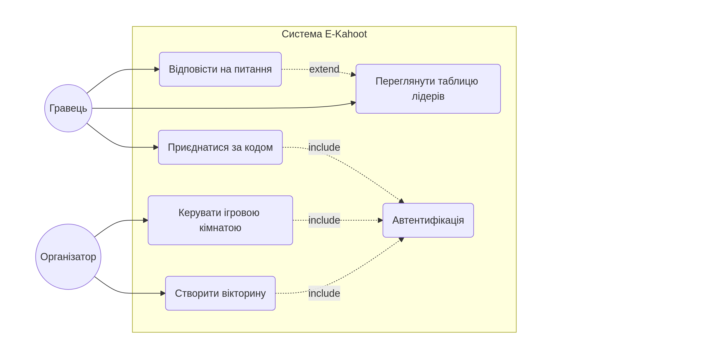
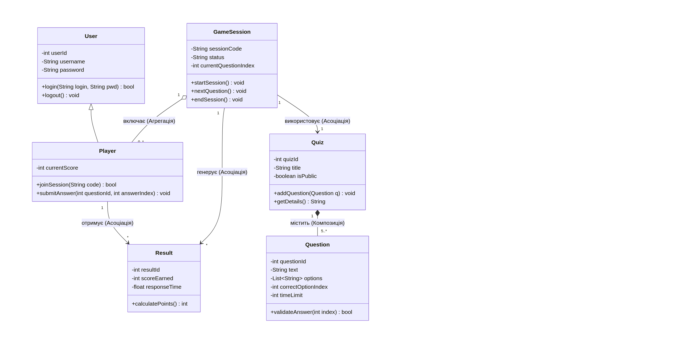
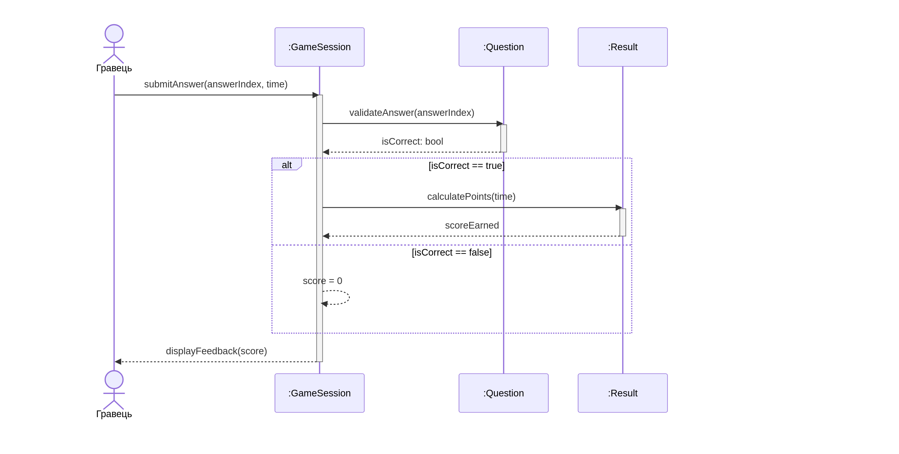

# E-Kahoot — Платформа для інтелектуальних змагань

## Опис проєкту
**E-Kahoot** — це програмна система для проведення швидких інтелектуальних змагань у реальному часі. Основна мета системи — надати користувачам можливість створювати вікторини та змагатися з друзями за допомогою ігрових кімнат і динамічних таблиць лідерів.

## 1. Функціональні вимоги (FR)
Повний список вимог доступний у файлі: [requirements.md](./requirements.md).

| ID | Опис вимоги |
| :--- | :--- |
| **FR-01** | Створення власних вікторин із питаннями та відповідями. |
| **FR-02** | Створення ігрових кімнат за унікальним кодом. |
| **FR-03** | Підтримка режиму реального часу для надсилання відповідей. |
| **FR-04** | Автоматичний розрахунок балів (правильність + швидкість). |
| **FR-05** | Відображення динамічної таблиці лідерів. |
| **FR-06** | Автентифікація користувачів (логін/пароль). |

## 2. UML Моделювання системи
Усі діаграми побудовані з використанням нотації **UML 2.5**.

### 2.1 Діаграма прецедентів (Use Case Diagram)
Відображає взаємодію Гравця та Організатора з функціями системи.

### 2.2 Діаграма класів (Class Diagram)
Статична структура системи, що містить класи `User`, `Quiz`, `GameSession` та інші, із зазначенням атрибутів, методів та зв'язків.

### 2.3 Діаграма послідовності (Sequence Diagram)
Динаміка сценарію «Відправка відповіді та нарахування балів» (FR-04).

## 3. Трасовність проєкту
Для забезпечення горизонтальної трасовності від вимог до моделей розроблено матрицю: [matrix.md](./matrix.md).

## 4. Структура репозиторію
* `diagrams/` — експортовані зображення діаграм у форматі PNG.
* `diagrams/src/` — вихідний код діаграм у форматі Mermaid.
* `requirements.md` — детальний опис функціональних вимог.
* `matrix.md` — матриця трасовності вимог.

---
**Виконав:**
Студент групи ПЗПІ-25-1 
Згонник Д.
